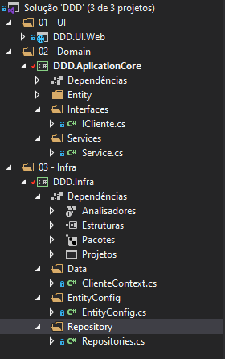

# Organizacao-DDD

## Projeto criado para mostrar uma organização geral de uma aplicação utilizando princípios de DDD.

Organizacao das pastas:

1. UI

Camada para a interface do usuário. Podendo conter projetos como Web, Mobile e Desktop;

2. Domain

Camada para a regra de negócio da aplicação. Contendo as Entities, Interfaces e Services da aplicação.

3. Infra

Camada para dados e comunicação com o banco de dados. Contendo Data, EntityConfig e Repository.

